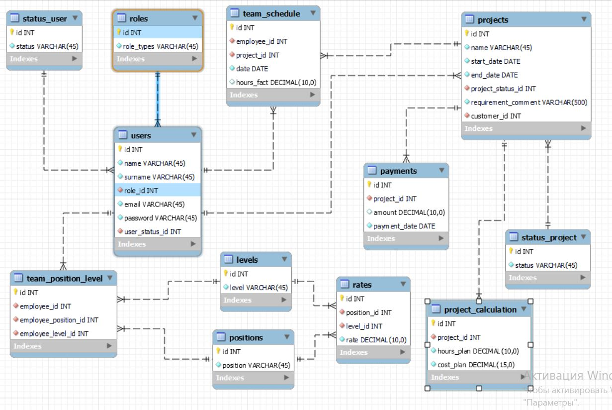

## EPAM_JWD_Final_Web-Project
***
### Topic №21
### Development Team
The customer provides the requirement specification, 
which specifies the list of activities indicating the qualifications and the number of required specialists.
The manager reviews the TOR and prepares the project, assigning available developers
of the required qualification,
after which the cost of the project is calculated and the customer is billed.
The developer has the opportunity to post the number of hours spent on the project.

### General requirements for the Web-Project:
1. Application architecture must comply with Layered architecture & Model-View-Controller patterns. 
 - Information about the subject area should be stored in the database.
    - Data in the database is stored in Cyrillic, it is recommended to use utf-8
    - Database access technology - JDBC (JDBC only).
    - To interact with the database, a connection pool must be implemented.
    - Access data using the DAO template. 
 
2. Application interface must be internationalized. Language selection: English, Russian.
3. The application must handle and log exceptions correctly. Use Log4j as a logger.
4. Classes must be well-structured into packages and have a name corresponding to their functionality.
5. Design patterns should be used if necessary (for example, GoF patterns: Factory Method, Command, Builder, Strategy, State, Observer etc). 
Procedural programming should be avoided.
6. Use the session to store user's information between requests.
7. Apply filters to process request and response objects (f.e. to set the request/response encoding option).
8. JSTL tags must be used when implementing JSP pages, scriptlets are not allowed. A custom tag must be implemented and used. 
Viewing “long lists” should be organized in pagination.
9. Documentation for the project must be design according to javadoc.
10. Code formatting must correspond to the Java Code Convention.

#### General requirements for the functionality of the project.
 - Sign in and sign out;
 - Sign up;
 - Viewing the existing information (f.e. viewing all users registered in the system);
 - Removing information (f.e. inactivating the user);
 - Adding and modifying the information (f.e. creation of new project, updating the existing project's info).

#### Technologies
Servlet, JSP, JSTL, JDBC, MySQL, Log4J2, JUnit5/TestNG
#### Design patterns
Front controller, Command, Builder, Singleton
#### Database diagram

